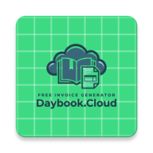

<div align="center">
  

  # Free Invoice Generator

  Create invoices in your brand’s style from a large library of ready-made templates. Completely free. No credit card. No signup.

  Free Invoice Generator is made by Tociva Private Limited (tociva.com) as part of daybook.cloud.

  Private, offline-first Android and iOS apps for creating, managing, exporting, and sharing professional invoices.

  [](https://developer.android.com/)
  [](https://kotlinlang.org/)
  [](https://www.jetbrains.com/compose-multiplatform/)
  [](LICENSE.md)
</div>

## Overview

Free Invoice Generator helps freelancers and small businesses build polished invoices directly on a mobile device. Invoice and business data is stored locally, and PDF generation runs on-device without requiring an account or internet connection.

Both Android and iOS run the same Compose Multiplatform app from the `shared` module. Platform-specific code is limited to PDF rendering, file sharing, notifications, logo picking, and database file paths.

| Platform | Implementation |
| --- | --- |
| Android | Thin `app` shell that hosts `SharedApp` via `MainActivity` |
| iOS | Thin SwiftUI host (`ComposeRootView`) that links the `Shared` framework and calls `MainViewController()` |

## Features

- Guided **Simple** and **Advanced** invoice creation workflows
- Business branding with organization details and a custom logo
- Customer details, line items, discounts, notes, terms, and due dates
- Taxable and non-taxable invoices, including **CGST/SGST** and **IGST** modes
- Bank account and UPI payment details
- 18 supported currencies and configurable decimal precision
- Automatic invoice numbering with a customizable prefix
- 154 bundled invoice templates across professional, modern, creative, retail, healthcare, and other styles
- On-device A4 PDF generation, download, and sharing
- Local invoice history with draft, sent, paid, and overdue states
- Light, dark, and system theme options
- Room-backed persistence and database migration coverage

## Tech stack

| Area | Technology |
| --- | --- |
| Languages | Kotlin (shared) and Swift (iOS host only) |
| UI | Compose Multiplatform / Material 3 |
| Architecture | Shared UI, domain, and data layers with repositories and ViewModels |
| Dependency injection | Manual composition root in `shared` (`AppContainer`) |
| Local database | Room KMP with `BundledSQLiteDriver` |
| Preferences | Platform key-value store (`SharedPreferences` / `UserDefaults`) |
| Navigation | JetBrains Navigation Compose (KMP) |
| PDF rendering | Shared HTML templates; Android WebView print APIs; iOS `WKWebView` PDF |
| Networking | Ktor (remote template catalog) |
| Build | Gradle Kotlin DSL with a version catalog; Xcode for iOS packaging |
| Testing | JUnit 4, AndroidX Test, Espresso, Compose UI Test, and Room Test |

## Requirements

- Android Studio with support for Android Gradle Plugin 9.3.3
- JDK 17 or newer to launch Gradle (the configured daemon toolchain uses JDK 25 and can be provisioned automatically)
- Android SDK 37
- An emulator or physical device running Android 9 (API 28) or newer
- macOS with Xcode 16 or newer for the iOS app
- An iOS 17+ simulator or device

The repository includes the Gradle wrapper, so a separate Gradle installation is not required.

## Getting started

1. Clone the repository:

   ```bash
   git clone git@github.com:tociva/free-invoice-generator-mobile.git
   cd free-invoice-generator-mobile
   ```

2. Open the project in Android Studio, install SDK Platform 37 and the requested build tools from **SDK Manager**, then allow Gradle sync to finish.

3. For Android, select an Android 9+ device or emulator and run the `app` configuration.

4. For iOS, open `ios/FreeInvoiceGenerator.xcodeproj`, select the `FreeInvoiceGenerator` scheme, and choose an iOS 17+ simulator. Xcode runs a build phase that compiles the `Shared` framework via Gradle.

## Building the apps

The platform builds are intentionally separate. Both scripts place generated artifacts under the repository's existing build directories.

### Android

Build the Android debug APK from macOS, Linux, or Windows with a Bash environment:

```bash
bash scripts/build-android.sh
```

The debug APK is generated at `app/build/outputs/apk/debug/app-debug.apk`.

To build directly with Gradle instead:

```bash
bash gradlew assembleDebug
```

### iOS

Build the unsigned iOS Simulator app on macOS with Xcode installed:

```bash
bash scripts/build-ios.sh
```

The app bundle is generated at `build/ios/Build/Products/Debug-iphonesimulator/Free Invoice Generator.app`.

To invoke Xcode directly instead:

```bash
bash gradlew :shared:linkDebugFrameworkIosSimulatorArm64

xcodebuild \
  -project ios/FreeInvoiceGenerator.xcodeproj \
  -scheme FreeInvoiceGenerator \
  -configuration Debug \
  -sdk iphonesimulator \
  -destination 'generic/platform=iOS Simulator' \
  -derivedDataPath build/ios \
  FRAMEWORK_SEARCH_PATHS="$PWD/shared/build/bin/iosSimulatorArm64/debugFramework" \
  OTHER_LDFLAGS="-framework Shared" \
  CODE_SIGNING_ALLOWED=NO \
  build
```

Device and App Store builds require an Apple Developer team and signing configuration in Xcode.

## Opening the apps in emulators

Each launcher builds first, then installs and opens the app. Gradle and Xcode skip recompilation when nothing relevant has changed since the last build.

### Android emulator

Open the Android app on a running emulator, or start the first configured Android Virtual Device automatically:

```bash
bash scripts/run-android.sh
```

To start a specific AVD, pass its name:

```bash
bash scripts/run-android.sh Pixel_9_API_35
```

List the available AVD names with `emulator -list-avds`. You can also set the `ANDROID_AVD` environment variable instead of passing a name.

### iOS Simulator

Open the iOS app on a booted iPhone Simulator, or start the first available iPhone Simulator automatically:

```bash
bash scripts/run-ios.sh
```

To start a specific simulator, pass its device name:

```bash
bash scripts/run-ios.sh "iPhone 16 Pro"
```

List available devices with `xcrun simctl list devices available`. You can also set the `IOS_SIMULATOR` environment variable instead of passing a name.

## Testing

Run the local unit tests:

```bash
bash gradlew testDebugUnitTest
```

Run the instrumented tests on a connected device or emulator:

```bash
bash gradlew connectedDebugAndroidTest
```

The test suite covers invoice calculations, money formatting, Room persistence and migrations, settings persistence, and PDF export.

## Project structure

```text
shared/src/
├── commonMain/kotlin/.../
│   ├── data/                  # Room, preferences, mappers, repositories
│   ├── di/                    # AppContainer composition root
│   ├── domain/                # Models, repository contracts, calculations
│   ├── pdf/                   # Shared HTML template rendering
│   ├── platform/              # expect/actual platform APIs
│   ├── ui/                    # Compose screens, navigation, theme, ViewModels
│   └── shared/SharedApp.kt    # Shared app entry point
├── androidMain/               # Android platform implementations
└── iosMain/                   # iOS platform implementations + MainViewController

app/src/main/java/.../
├── MainActivity.kt            # Android entry → SharedApp
├── DaybookApplication.kt      # Platform init + PDF bridge registration
├── AndroidPdfBridgeSetup.kt   # Wires HtmlPdfPrinter into shared module
└── pdf/                       # Android WebView PDF printer

ios/
├── FreeInvoiceGenerator/      # Swift Compose host (ComposeRootView)
└── FreeInvoiceGenerator.xcodeproj/

scripts/
├── build-android.sh           # Android debug APK build
├── build-ios.sh               # Unsigned iOS Simulator build
├── run-android.sh             # Build if needed, then open the APK in an Android emulator
└── run-ios.sh                 # Build if needed, then open the app in iOS Simulator
```

## Privacy and permissions

Neither app requires internet access for its core workflow. Invoice data is stored in a local Room database on both platforms. Generated PDFs are saved or shared through each platform's native file APIs. On supported Android versions, notification permission is used to report completed downloads.

## Contributing

Contributions are welcome. To propose a change:

1. Fork the repository and create a focused feature branch.
2. Make the change and add or update tests where appropriate.
3. Run the relevant unit and instrumented tests.
4. Open a pull request describing the motivation and implementation.

Please keep changes consistent with the shared Compose architecture and existing conventions.

## License

This project is available under the [MIT License](LICENSE.md).
